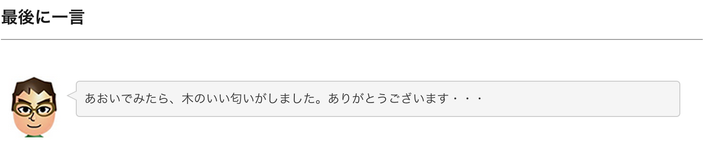

hukidasi4blog
=============
## Blogなどで使いやすい吹き出しのhtml/cssコードです


## 参考・謝辞
アシアルブログさんのエントリにインスパイアされて
http://blog.asial.co.jp/1140

 - 顔アイコン対応
 - コンテンツが伸びても追従
 - 横幅をBlogに合わせて可変
 - 色を調整
 - 左に顔、右に吹き出し

的な改造を施しました。

アシアルブログさん、ありがとうございます。

## 使い方
 - style.cssを適宜修正してBlogに追加
 -- 顔アイコンは任意のものを用意してurlをbackground-imageに記述してください
 - code.htmlの、div.comment_innerタグの中にコメントを書いてください。任意のHTMLが使えると思います。

## TextExpander使いの方へのTips
Blog執筆にTextExpander（Mac用のスニペットアプリ）を使っている方であれば

```
<h3>最後に一言</h3>
<div class="comment_outer">
<div class="comment_inner">%|</div>
</div>
```

のようなコードをスニペットとして登録しておけば、キャレットがdiv.comment_innerタグの中に移動するのでより便利かと思います。
